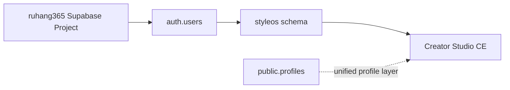

# Architecture

This document defines the product architecture without implementation code.

## High-Level Architecture


## Alpha Supabase Architecture



StyleOS Alpha reuses the existing ruhang365 Supabase Project and shared `auth.users`. StyleOS business data belongs in the dedicated `styleos` schema.

`public.profiles` can remain the ruhang365 unified profile layer, but this Alpha migration does not modify it.

The Alpha schema does not introduce workspace or team tables. Creator-owned records use `creator_user_id` directly.

## v0.2.2 Storage Architecture

Creator Studio CE now has two storage adapters behind one app workflow:

- Local adapter: browser localStorage, default mode, no Supabase required.
- Supabase adapter: existing ruhang365 Supabase Project, shared `auth.users`, dedicated `styleos` schema.

The app chooses the adapter from `NEXT_PUBLIC_STORAGE_MODE`.

If Supabase Mode is requested without a public URL and public key, the app falls back to Local Mode and shows a setup warning.

## Public Token Routes

Supabase Mode uses server route handlers for public fan flows:

- `/api/intake/[token]`
- `/api/reports/[shareToken]`
- `/api/feedback/[shareToken]`

These routes use token lookup and return only the data needed for fan intake, shared report reading, and feedback submission.

Service role or secret keys are server-only. They must not enter client bundles.

## Health Check Route

- `/api/health`

This route returns safe deployment readiness metadata only. It does not use public fan tokens, does not query business data, and does not expose secrets.

## v0.2.3 Hosted Alpha Layer

The Alpha preparation layer keeps the same application architecture and adds deployment readiness around it:

```mermaid
flowchart LR
    A[Invited Alpha Creator] --> B[Vercel-hosted Next.js App]
    B --> C[/api/health]
    B --> D[Supabase Auth magic link]
    B --> E[Token route handlers]
    E --> F[ruhang365 Supabase Project]
    F --> G[styleos schema]
```

The hosted Alpha target is Vercel. The app still uses the existing ruhang365 Supabase Project, shared `auth.users`, and the dedicated `styleos` schema.

`/api/health` returns only configuration booleans, app version, storage mode, Alpha mode, and timestamp. It does not query business data and does not expose secrets.

The Alpha deployment preparation does not create a Vercel project, does not execute SQL, and does not modify database structure.

## Shared Auth

Creator login uses Supabase Auth magic links and the existing ruhang365 `auth.users` table.

CE v0.2.2 does not write to `public.profiles`, does not introduce workspace tables, and does not add a team model.

## Protocol Integration

CE gets these public structures from `styleos-protocol`:

- schema
- taxonomy
- starter rules
- report templates
- execution cards

CE should treat protocol content as the open standard layer. It should not copy StyleOS Pro content or present starter rules as expert-certified.

## Knowledge Layers

### Open Protocol Library

- starter rules
- synthetic examples
- public schemas

### Creator Working Library

- creator's own templates
- creator's notes
- creator's cases

Creator Working Library data belongs to the creator workspace and should not become public protocol content without authorization, anonymization, and review.

### Candidate Knowledge Queue

- anonymized feature-solution-feedback mapping
- requires consent and review
- may become public rule or Pro candidate

Candidate knowledge should store structured learning, not personal identity data.

## Future Cloud Layer

StyleOS Cloud may add:

- hosted accounts
- team access
- billing
- higher limits
- Pro library access
- certified partner workflows
- data governance

Cloud is a planned hosted product and is not implemented in this v0.1 CE definition.
