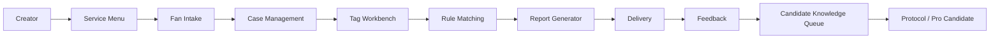

# Architecture

This document defines the product architecture without implementation code.

## High-Level Architecture

## Protocol Integration

CE gets these public structures from `styleos-protocol`:

- schema
- taxonomy
- starter rules
- report templates
- execution cards

CE should treat protocol content as the open standard layer. It should not copy StyleOS Pro content or present starter rules as expert-certified.

## Knowledge Layers

### Open Protocol Library

- starter rules
- synthetic examples
- public schemas

### Creator Working Library

- creator's own templates
- creator's notes
- creator's cases

Creator Working Library data belongs to the creator workspace and should not become public protocol content without authorization, anonymization, and review.

### Candidate Knowledge Queue

- anonymized feature-solution-feedback mapping
- requires consent and review
- may become public rule or Pro candidate

Candidate knowledge should store structured learning, not personal identity data.

## Future Cloud Layer

StyleOS Cloud may add:

- hosted accounts
- team access
- billing
- higher limits
- Pro library access
- certified partner workflows
- data governance

Cloud is a planned hosted product and is not implemented in this v0.1 CE definition.
