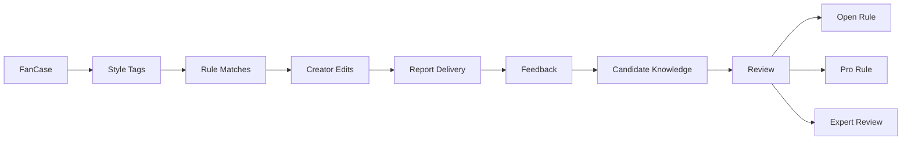

# Knowledge Flow

StyleOS does not need to collect personal identity data as its core asset.

The core asset is feature-solution-outcome mapping.

中文说明：
StyleOS 真正需要沉淀的不是用户身份信息，而是身体 / 面部 / 发型 / 风格等特征标签下，对应什么造型优化方案，以及执行后的反馈结果。

## Flow

## Step Notes

1. FanCase captures the service workflow.
2. Style Tags convert raw input into structured signals.
3. Rule Matches connect tags to starter or creator rules.
4. Creator Edits keep human judgment in the loop.
5. Report Delivery creates the user-facing output.
6. Feedback records whether the recommendation helped.
7. Candidate Knowledge stores anonymized feature-solution-feedback mapping.
8. Review decides whether the candidate becomes open rule, Pro rule, expert-review candidate, or archived.

## Knowledge Guardrails

- Do not store real photos as knowledge assets.
- Do not treat names, contacts, or identity as reusable knowledge.
- Do not move case data into knowledge without consent.
- Do not publish private cases.
- Do not mark candidate knowledge as verified without review.
