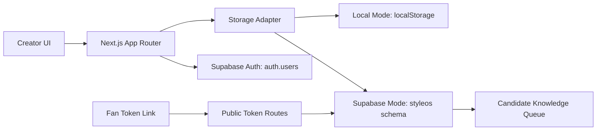

# Technical Architecture Summary

## Stack

- Next.js App Router
- React
- TypeScript
- Vercel Hosted Alpha
- Supabase JS
- Existing ruhang365 Supabase Project

## Modes

### Local Mode

Local Mode is the default. It uses browser localStorage and does not require Supabase. It keeps CE runnable for contributors and self-hosted experiments.

### Supabase Mode

Supabase Mode is optional. It uses the existing ruhang365 Supabase Project, shared `auth.users`, and the dedicated `styleos` schema.

## Hosted Alpha

The hosted Alpha runs on Vercel:

```text
https://styleos-creator-studio-ce.vercel.app
```

The hosted environment uses Supabase Mode and Alpha Mode.

## Auth

Creator login uses Supabase Magic Link Auth. The app does not write to `public.profiles` and does not introduce workspace or team tables in the current Alpha.

## Public Token Routes

Fan-facing and shared flows are served through tokenized route handlers:

- `/api/intake/[token]`
- `/api/reports/[shareToken]`
- `/api/feedback/[shareToken]`

These routes must not return creator private data, service role keys, SQL details, or Candidate Knowledge internals.

## Data Boundary

All StyleOS business data belongs in the `styleos` schema:

- services
- fan_cases
- reports
- feedback
- candidate_knowledge
- consent_records

Existing ruhang365 `public` tables are outside current CE scope.

## Candidate Knowledge Queue

Candidate Knowledge is the learning layer. It stores abstracted feature-solution-outcome mapping, not identity data. It should only advance after consent, anonymization, and review.

## Architecture Diagram


