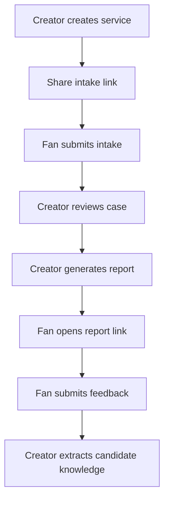

# Shareable Cloud Workflow

Supabase Mode enables token-based cross-device workflows without requiring fans to log in.

## Flow

1. Creator signs in with Supabase magic link.
2. Creator creates a hairstyle service.
3. The service gets an `intake_token`.
4. Fan opens `/intake/[intake_token]`.
5. Fan submits structured intake without logging in.
6. Creator reviews the resulting case.
7. Creator creates a Lite Report and Barber Brief.
8. The report gets a `share_token`.
9. Fan opens `/reports/[share_token]`.
10. Fan submits feedback at `/feedback/[share_token]`.
11. Creator extracts candidate knowledge after reviewing consent and feedback.

## Privacy Boundary

The workflow does not store raw photos, phone numbers, WeChat IDs, ID card numbers, addresses, or email fields in StyleOS business tables.

Candidate knowledge stores abstracted feature-solution-outcome mapping, not personal identity data.
