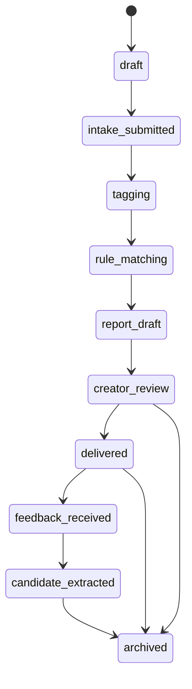

# State Machine

FanCase state machine.

## States

- `draft`: service case created but not submitted.
- `intake_submitted`: fan intake received.
- `tagging`: creator reviews and assigns tags.
- `rule_matching`: system or creator matches rule cards.
- `report_draft`: lite report generated or started.
- `creator_review`: creator manually edits and approves.
- `delivered`: report delivered to fan/client.
- `feedback_received`: feedback submitted.
- `candidate_extracted`: anonymized candidate knowledge extracted.
- `archived`: workflow closed.
